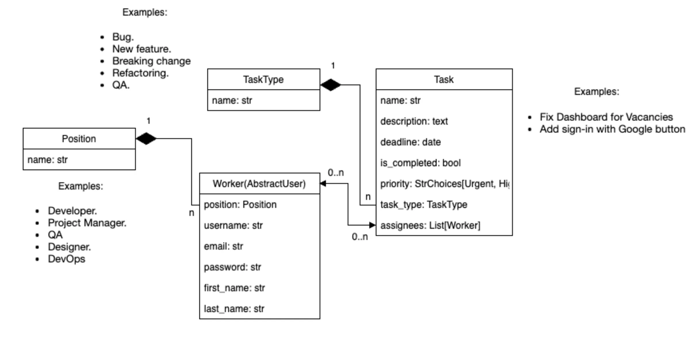

# Менеджер завдань IT-компанії

У тебе є команда розробників, дизайнерів, project-менеджерів та QA-спеціалістів. Також у тебе є безліч завдань, пов’язаних з IT-сферою. Але чомусь ти досі не чув(-ла) нічого про Trello або ClickUp.
Тож ти вирішив(-ла) реалізувати власний менеджер завдань, який розв'язуватиме можливі проблеми під час розробки продукту твоєю командою. Кожен член команди може створювати завдання, призначати це
завдання іншим членам команди та позначати його як виконане (звісно, краще до дедлайну).

## Структура бази даних:

Додаткові ідеї (опціонально):

- Для кожного працівника окремо відображаються виконані та невиконані завдання. Додати теги (наприклад, landing-page-layout або python-refactoring) для завдань зі зв'язком Many-to-Many.

- Суперскладна ідея (опціонально): додати підтримку Projects та Teams. Різні команди можуть працювати над різними проєктами, і також всередині кожного проєкту є багато завдань.

Стуктура проекту. it_task_manager/ │ ├── .gitignore # Ігнорування файлів (venv, db.sqlite3, .env тощо) ├── README.md # Опис проєкту (який ви надали) ├── requirements.txt # Залежності проєкту (django,
pillow, python-dotenv тощо) ├── db.sqlite3 # Локальна база даних (створиться автоматично) ├── manage.py # Головний скрипт керування Django │ ├── it_company_project/ # Головна директорія налаштувань
(Configuration Root) │ ├── **init**.py │ ├── asgi.py │ ├── settings.py # Усі налаштування проєкту │ ├── urls.py # Головний маршрутизатор (включає urls додатків) │ └── wsgi.py │ ├── task_manager/ #
Основний додаток для логіки таск-менеджеру │ ├── migrations/ # Міграції бази даних │ ├── **init**.py │ ├── admin.py # Налаштування адмін-панелі Django │ ├── apps.py │ ├── forms.py # Форми для
створення/редагування завдань та фільтрації │ ├── models.py # Моделі (Worker, Position, Task, Tag) │ ├── tests.py # Тести для перевірки логіки │ ├── urls.py # Маршрути для сторінок таск-менеджеру │
└── views.py # Контролери/Представлення (Class-Based Views) │ ├── templates/ # Глобальні HTML-шаблони │ ├── base.html # Головний каркас сайту (навігація, футер, підключення стилів) │ └── includes/ │
└── pagination.html # Шаблон для пагінації списків │ └── static/ # Статичні файли (CSS, JS, зображення) ├── css/ │ └── styles.css # Ваші кастомні стилі ├── js/ └── images/ # Папка для картинок
(наприклад, іконки або логотип)
