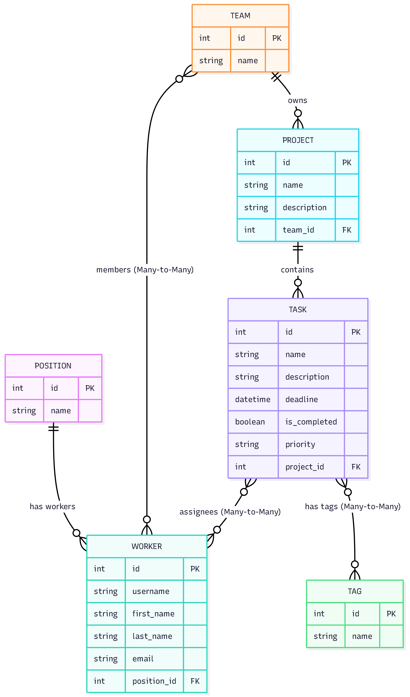

# IT company task manager

You have a team of developers, designers, project managers, and QA specialists. You also have a lot of IT-related tasks. But the team doesn't work with Trello or ClickUp for economic reasons.

Therefore, the team decided to implement its own task manager, which will solve possible problems during the development of the product by your team. Each team member can create tasks, assign this
task to other team members, and mark it as completed (of course, preferably before the deadline).

## Database structure:



Project features:

- Completed and uncompleted tasks are displayed separately for each employee. Add tags for tasks with a Many-to-Many relationship.

- Support for Projects and Teams. Different teams can work on different projects, and there are also many tasks inside each project.

Project structure:

```text
it_task_manager/
│
├── .gitignore                   # Ігнорування файлів (venv, db.sqlite3, .env тощо)
├── README.md                    # Опис проєкту (який ви надали)
├── requirements.txt             # Залежності проєкту (django, pillow, python-dotenv тощо)
├── db.sqlite3                   # Локальна база даних (створиться автоматично)
├── manage.py                    # Головний скрипт керування Django
│
├── task_manager_service/        # Головна директорія налаштувань (Configuration Root)
│   ├── __init__.py
│   ├── asgi.py
│   ├── settings.py              # Усі налаштування проєкту
│   ├── urls.py                  # Головний маршрутизатор (включає urls додатків)
│   └── wsgi.py
│
├── task_manager/                # Основний додаток для логіки таск-менеджеру
│   ├── migrations/              # Міграції бази даних
│   ├── __init__.py
│   ├── admin.py                 # Налаштування адмін-панелі Django
│   ├── apps.py
│   ├── forms.py                 # Форми для створення/редагування завдань та фільтрації
│   ├── models.py                # Моделі (Worker, Position, Task, Tag)
│   ├── tests.py                 # Тести для перевірки логіки
│   ├── urls.py                  # Маршрути для сторінок таск-менеджеру
│   └── views.py                 # Контролери/Представлення (Class-Based Views)
│
├── templates/                   # Глобальні HTML-шаблони
│   ├── base.html                # Головний каркас сайту (навігація, футер, підключення стилів)
│   └── includes/
│   │   └── pagination.html      # Шаблон для пагінації списків
│   └── registation/
│   │   └── register.html        # Шаблон для регістрації працівників
│   │   └── login.html           # Шаблон для входу працівника в систему
│   └── task_manager/
│   │   └── index.html           # Главная страница (Dashboard)
│   │   └── my_task_list.html    # Кабінет працівника в системі
│   │   └── project_details.html # Опис поточного проекту
│   │   └── project_list.html    # Проекти поточного працівника
│   │   └── task_detail.html     # Опис поточного завдання
│   │   └── task_form.html       # Шаблон форми для створення завдання
│   │   └── task_list.html       # Завдання для поточного працівника
│
└── static/                      # Статичні файли (CSS, JS, зображення)
    ├── css/
    │   └── styles.css           # Ваші кастомні стилі
```

# Deploying my project

The following steps were taken:

- The Render service deploys the project to the server
- a test user was added so that visitors to my site could also explore the functionality:
  - user: serg_braun
  - password: A7k9M2xQ
